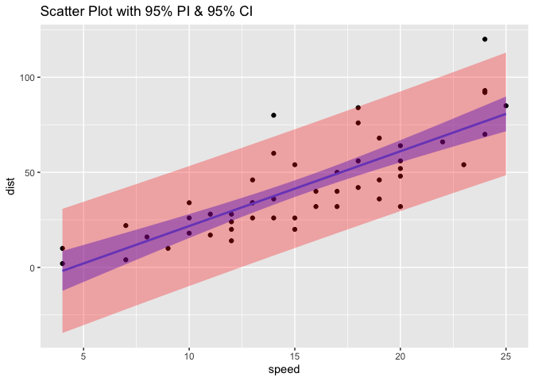

Blog Post 3
================
Sandra Aziz

# Coolest Thing I Learned so far!

I have been learning how to program in R for about a month now and I’ve
quickly found the coolest thing to be graphs! Not the basic `plot`
function, but the `ggplot` function. From an aesthetic point of view, I
like how modern it makes the plot looks. From a functionality point of
view, I love that you can layer multiple graphs on top of each other to
compare multiple trends or to find information and predictions about the
data.

Below are some of my favorite examples that we’ve done in class so far:

``` r
library(tidyverse)
library(ciTools)

fit <- lm(dist~speed, data=cars)
cars <- cars %>% 
        add_pi(fit, names = c("lower","upper"))

ggplot(cars, aes(x = speed, y = dist)) + geom_point() +
geom_smooth(method = "lm", fill = "Blue") +
geom_ribbon(aes(ymin = lower, ymax = upper), alpha = 0.3, fill = "Red") + ggtitle("Scatter Plot with 95% PI & 95% CI")
```

<!-- -->

This plot shows a scatter plot of the distance and speed. It also shows
a 95% Confidence Interval in purple and a 95% Prediction Interval in
pink. It doesn’t only plot the data we have, but also shows
possibilities of where new data points may fall.

I’m excited to continue learning about plots, especially using ggplot
and all its layers!
